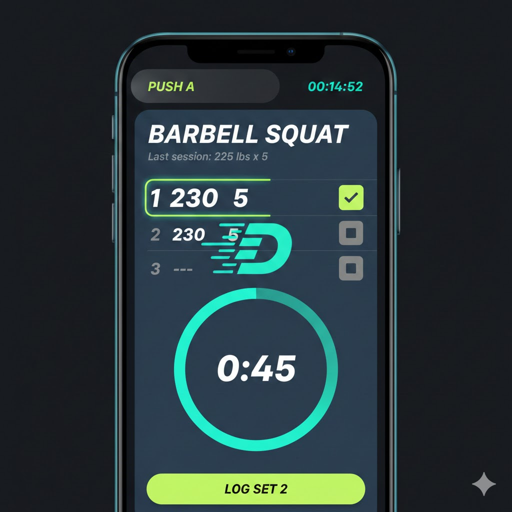

# Duro: Visual Design Concept & UI Strategy

**Source:** Gemini AI response

**Project Overview:** A modern, high-performance Gym PWA designed for recording workout data with high numerical density and maximum readability in a gym environment.

---

## 1. The Logo Concept: "Dynamic Duro"
To capture movement and dynamism, the logo avoids static, heavy block lettering in favor of speed and fluidity.

* **The Font:** An ultra-modern, italicized **Display Sans-Serif** (e.g., *Archivo Black* or *Integral CF*). The slant suggests forward momentum.
* **The "D" Icon:** A stylized letter "D" where the curved side is composed of three parallel "speed lines" or "motion streaks," mimicking a weight plate in motion or a track lane.
* **The Hook:** The "o" in Duro is a perfect circle with a "loading" ring around it, hinting at progress tracking and set completion.

---

## 2. Color Palette: "Electric Midnight"
Designed for high contrast under harsh gym lighting. Dark mode is the primary interface to reduce glare and allow vibrant accents to guide the user's eye.

| Element | Color Name | Hex Code | Purpose |
| :--- | :--- | :--- | :--- |
| **Primary Base** | Deep Obsidian | `#0B1215` | Main background for maximum contrast. |
| **Surface** | Petrol Blue | `#1A2A32` | Cards, panels, and input fields. |
| **Primary Accent** | Cyber Lime | `#CCFF00` | CTA buttons, "Start Workout," active states. |
| **Secondary Accent**| Electric Teal | `#00F5FF` | Timers, progress bars, and "Success" states. |
| **Data Neutral** | Slate Grey | `#94A3B8` | Sub-labels (e.g., "lbs", "reps", "Set 1"). |
| **High Contrast** | Pure White | `#FFFFFF` | Primary numerical data. |

---

## 3. Data Density & Readability Strategy
To handle high numerical density (Sets × Weight × Reps) on mobile:

* **Visual Hierarchy:** Use **Light Text on Dark Surfaces**. This allows the use of font weight and color vitality to differentiate between "Target" data and "Input" data.
* **Monospaced Numbers:** Use monospaced fonts (e.g., *JetBrains Mono*) for weight and rep counts to prevent the layout from "jumping" when values change.
* **The "Squint Test":** Current active data is **25% larger** and highlighted in Cyber Lime, ensuring it's readable from several feet away.
* **Color-Blocking:** Avoid borders; use different shades of dark blue/grey to separate rows to reduce visual noise.

---

## 4. Visual Language & Components
* **Micro-Interactions:** "Liquid" progress bars that pulse or glow upon set completion.
* **Glassmorphism:** Subtle blur effects on overlays (like active timers) to maintain context of the underlying workout list.
* **Soft Geometry:** Large border-radii (`16px`) on cards to balance the "aggressive" high-energy colors with a modern, friendly feel.
* **Set Completion Flourish:** As the user completes a set, a small "D" logo animation appears momentarily — the speed lines on the "D" fly forward, giving a sense of "Leveling Up."

---

## 5. Active Workout Screen Layout
The "Critical Path" screen, optimized for thumb-reach and quick scanning.

### A. The Header (Status Bar)
* **Backdrop:** Semi-transparent Petrol Blue with backdrop-blur.
* **Content:** Workout Name (**"PUSH A"**) in Cyber Lime; Total Timer in Electric Teal. The colon (:) pulses slowly to show the app is active.
* **Progress:** 4px Electric Teal line at the very top showing overall routine completion.

### B. The Exercise Hero Card
* **Title:** **BARBELL SQUAT** (All caps, heavy italic).
* **History:** Slate Grey tag showing *"Last session: 225 lbs x 5"* for immediate motivation.
* **Visual Cue:** A subtle, dark-teal pulse animation behind the set number to indicate the active row.

### C. The Data Input Grid

| Set | Previous | Lbs | Reps | Action |
| :--- | :--- | :--- | :--- | :--- |
| **1** | 225 x 5 | **230** | **5** | [✓] |
| **2** | 225 x 5 | `---` | `---` | [ ] |

* **Active Row:** Highlighted with a Cyber Lime border (2px).
* **Numerical Font:** JetBrains Mono or similar. Numbers are Pure White.
* **Touch Targets:** Weight and Rep numbers act as large buttons. Tapping opens a custom "Duro Numpad" rather than the system keyboard.

### D. The "Big Action" Zone (Bottom 30%)
* **Rest Timer:** Large, circular "Liquid" countdown in the center.
* **Primary CTA:** Wide Cyber Lime button: **"LOG SET X"**. Features haptic feedback and a teal flash on tap.

---

## 6. Visual Mockup Reference

