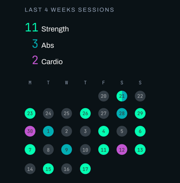

# Goal 1: visualise recent sessions on the dashboard

I'd like to replace the 'Recent sessions' section on the dashboard with a visualisation of sessions over the last 4 weeks. This will give the user a rolling snapshot of their recent frequency of workouts.

See the reference image 

For each routine that had at least one session in the last 4 weeks, show a summary line with the session count. Show up to 3 routines

Below that, a dot calendar of the sessions. Every day should have it's date number inside the dot (see reference image).

Each routine type should have its own colour. If a given day had more than one session using different routines, split that day's dot into half, thirds or quadrants and use all colours.

## CSS variable colours to use
Calendar dots:
- no session - background is --em-neutral at 30% transparency, text is --em-text-primary at 60% transparency
- for any day with a session - text is --em-text-inverse
- session using routine 1 - background is --em-accent-mint
- session using routine 2 - background is --em-accent-aqua
- session using routine 3 - background is --em-accent-flat-purple
- session using routine 4 - background is --em-accent-purple

## Responsive behaviour

The calendar should fill the column width, up to 768px. The dots and text should all scale proportionally to the viewport width, using the appropriate CSS unit.
At 768 and above, the section should adopt a 2 column layout with the routine summary counts in the left column and the calendar in the right column.

## Component

The calendar should be a separate Vue component, that accepts start and end dates as props, plus an array of sessions, and renders the calendar. That way it can later be reused in a dedicated page with a calendar for each month, Jan, Feb etc (out of scope for this goal).
